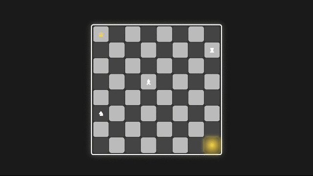

# ♟️ Good Game | گود گیم

<div dir="ltr">

**Good Game** is a unique real-time single-player puzzle game that mixes the logic of **Chess** and **Minesweeper**.

Your goal is to guide the **King** to the **Golden Square**. But the path is surrounded by hidden bombs.  
To discover where the bombs are, you can move the **Bishop**, **Rook**, and **Knight** across the board — each revealing how many bombs are near their target positions.

⚠️ If any of these helper pieces touch a bomb, **all discovered information will be erased**!

</div>

<div dir="rtl">

**گود گیم** یک بازی پازل تک‌نفره و بلادرنگ است که ترکیبی از منطق **شطرنج** و **مین‌سوییپر** می‌باشد.

هدف شما رساندن **شاه** به **خانه طلایی** است. اما مسیر او با بمب‌هایی پنهان احاطه شده.  
برای شناسایی موقعیت مین‌ها، می‌توانید از حرکت دادن مهره‌های **فیل، رخ، و اسب** استفاده کنید — این مهره‌ها به شما نشان می‌دهند در اطراف خانه‌ها چند بمب وجود دارد.

⚠️ اگر یکی از این مهره‌های کمکی به مین برخورد کند، **تمام اطلاعات کشف‌شده (خانه‌های آبی و تعداد بمب‌ها) پاک خواهد شد**!

</div>

---

## 🎮 Gameplay Summary | خلاصه گیم‌پلی

<div dir="ltr">

- Single-player, real-time logic puzzle  
- Move only 4 chess pieces: King (goal), Bishop, Rook, Knight (scanning)  
- Blue tiles = scanned safe zones  
- Numbers show how many bombs are nearby  
- Touching a bomb with helper pieces wipes all progress  
- Reach the Golden Square to win!

</div>

<div dir="rtl">

- پازل منطقی تک‌نفره و بلادرنگ  
- فقط ۴ مهره در بازی فعال هستند: شاه (هدف)، فیل، رخ و اسب (تحلیل‌گر)  
- خانه‌های آبی = مناطق امن شناسایی‌شده  
- اعداد نمایش‌دهنده تعداد بمب‌های مجاور هستند  
- برخورد هر مهره کمکی با مین، تمام داده‌های شناسایی‌شده را پاک می‌کند  
- رسیدن شاه به خانه طلایی = پیروزی!

</div>

---

## 📽 Demo | دموی بازی

<div align="center">
  


</div>

---

## 🛠 How to Run | نحوه اجرا

<div dir="ltr">

1. Clone the repository:
   ```bash
   git clone https://github.com/AlirezaRuohi/Good-Game.git
